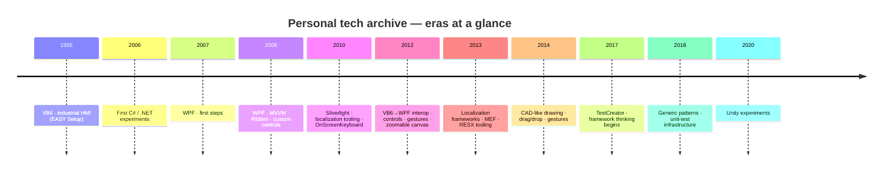

# Legacy project archive · 1995–2024

This page documents the personal engineering archive migrated from a local folder into GitHub in October 2026. It spans roughly three decades of learning, experimentation, and professional development — from VB6 HMI software to WPF architecture to modern .NET tooling.

Each repo represents a real project: client work, personal experiments, framework prototypes, or code written while learning a new technology. Build output and third-party reference DLLs were stripped; original file timestamps were used as commit dates so the GitHub history reflects the actual era.

---

## Technology evolution

---

## 1995–2007 · Industrial roots

The foundation: VB6 HMI software built for real machines, early C# experiments, and the very first WPF samples.

| Project | Years | Tech |
| --- | --- | --- |
| [`EASY Setup`](https://github.com/RenePeuser/EASY-Setup) | 1995-2012 | VB6 |
| [`Musik_Verwalten`](https://github.com/RenePeuser/Musik_Verwalten) | 2005-2008 | .NET |
| [`Sourcecode 24h-Software_2006`](https://github.com/RenePeuser/Sourcecode-24h-Software_2006) | 2006-2013 | .NET |
| [`LocBaml`](https://github.com/RenePeuser/LocBaml) | 2007-2013 | .NET |
| [`Silverlight Controls`](https://github.com/RenePeuser/Silverlight-Controls) | 2007-2010 | .NET |
| [`WPF_CodeSamples`](https://github.com/RenePeuser/WPF_CodeSamples) | 2007-2009 | .NET |

---

## 2008–2010 · WPF & MVVM

Deep investment in WPF — MVVM, the Ribbon control, custom controls, Silverlight, and the first reusable UI libraries.

| Project | Years | Tech |
| --- | --- | --- |
| [`24H_Schwimmen_WPF_Design`](https://github.com/RenePeuser/24H_Schwimmen_WPF_Design) | 2008-2012 | .NET |
| [`Bingo`](https://github.com/RenePeuser/Bingo) | 2008-2011 | .NET |
| [`DLRG`](https://github.com/RenePeuser/DLRG) | 2008-2011 | .NET |
| [`MVVM`](https://github.com/RenePeuser/MVVM) | 2008 | .NET |
| [`SLExtensions`](https://github.com/RenePeuser/SLExtensions) | 2008-2010 | .NET |
| [`AddressManagement`](https://github.com/RenePeuser/AddressManagement) | 2009-2013 | .NET |
| [`CSports`](https://github.com/RenePeuser/CSports) | 2009-2012 | .NET |
| [`EventManagement`](https://github.com/RenePeuser/EventManagement) | 2009-2011 | .NET |
| [`EventManagement_Dynamic`](https://github.com/RenePeuser/EventManagement_Dynamic) | 2009-2011 | .NET |
| [`InputSimulator.0.1.0.0-bin`](https://github.com/RenePeuser/InputSimulator.0.1.0.0-bin) | 2009 | Other |
| [`OnScreenKeyboard_VB6`](https://github.com/RenePeuser/OnScreenKeyboard_VB6) | 2009-2013 | .NET |
| [`RibbonTest`](https://github.com/RenePeuser/RibbonTest) | 2009-2012 | .NET |
| [`Sort Musik`](https://github.com/RenePeuser/Sort-Musik) | 2009 | .NET |
| [`Sport_Software`](https://github.com/RenePeuser/Sport_Software) | 2009-2011 | .NET |
| [`VB6_WPF_Toolkit`](https://github.com/RenePeuser/VB6_WPF_Toolkit) | 2009-2014 | .NET |
| [`WPF_Transitions_Effects`](https://github.com/RenePeuser/WPF_Transitions_Effects) | 2009-2012 | .NET |
| [`WpfKb.0.1.0.0-bin`](https://github.com/RenePeuser/WpfKb.0.1.0.0-bin) | 2009 | Other |
| [`Behaviors`](https://github.com/RenePeuser/Behaviors) | 2010-2013 | .NET |
| [`CommandStatus`](https://github.com/RenePeuser/CommandStatus) | 2010-2013 | .NET |
| [`ItemManagement`](https://github.com/RenePeuser/ItemManagement) | 2010-2011 | .NET |
| [`Management`](https://github.com/RenePeuser/Management) | 2010-2013 | .NET |
| [`MicrosoftRibbonForWPFSourceAndSamples`](https://github.com/RenePeuser/MicrosoftRibbonForWPFSourceAndSamples) | 2010-2013 | .NET |
| [`Silverlight 4`](https://github.com/RenePeuser/Silverlight-4) | 2010 | .NET |
| [`SkyDrive-2013-03-02`](https://github.com/RenePeuser/SkyDrive-2013-03-02) | 2010-2013 | .NET |
| [`TestRibbon`](https://github.com/RenePeuser/TestRibbon) | 2010-2013 | .NET |
| [`ToolStatistic`](https://github.com/RenePeuser/ToolStatistic) | 2010-2014 | .NET |
| [`WPF Themes`](https://github.com/RenePeuser/WPF-Themes) | 2010-2013 | .NET |
| [`wpfkb-a16225f82c48`](https://github.com/RenePeuser/wpfkb-a16225f82c48) | 2010-2012 | .NET |
| [`WPFProgressbar`](https://github.com/RenePeuser/WPFProgressbar) | 2010-2012 | .NET |
| [`WpfRibbonApplication1`](https://github.com/RenePeuser/WpfRibbonApplication1) | 2010-2012 | .NET |
| [`WPFRibbonTest`](https://github.com/RenePeuser/WPFRibbonTest) | 2010-2013 | .NET |
| [`ZoomableApplication2`](https://github.com/RenePeuser/ZoomableApplication2) | 2010-2013 | .NET |

---

## 2011–2013 · Controls, Silverlight & Localization

Scaling up: 52 projects covering VB6↔WPF interop, virtual keyboards, touch input, zoomable canvases, outlookbar, and a full localization tooling suite (RESX, ResourceDictionary, markup extensions, LocBaml).

| Project | Years | Tech |
| --- | --- | --- |
| [`JhVirtualKeyboard_WPF`](https://github.com/RenePeuser/JhVirtualKeyboard_WPF) | 2011-2012 | .NET |
| [`Learning`](https://github.com/RenePeuser/Learning) | 2011 | .NET |
| [`Advantech.USB4761`](https://github.com/RenePeuser/Advantech.USB4761) | 2012 | .NET |
| [`Advantech4761`](https://github.com/RenePeuser/Advantech4761) | 2012 | .NET |
| [`DynamicViewModel`](https://github.com/RenePeuser/DynamicViewModel) | 2012-2020 | .NET |
| [`FullGeneric`](https://github.com/RenePeuser/FullGeneric) | 2012-2020 | .NET |
| [`GenericApp`](https://github.com/RenePeuser/GenericApp) | 2012-2018 | .NET |
| [`InterfaceVB6_WPF`](https://github.com/RenePeuser/InterfaceVB6_WPF) | 2012 | .NET |
| [`RibbonControlForm`](https://github.com/RenePeuser/RibbonControlForm) | 2012 | .NET |
| [`RibbonInterOp`](https://github.com/RenePeuser/RibbonInterOp) | 2012 | .NET |
| [`SilverlightApplication1`](https://github.com/RenePeuser/SilverlightApplication1) | 2012-2013 | .NET |
| [`TestToolKitVB6`](https://github.com/RenePeuser/TestToolKitVB6) | 2012 | .NET |
| [`VB6 WPF Ribbon`](https://github.com/RenePeuser/VB6-WPF-Ribbon) | 2012 | VB6 |
| [`WPF in WinForms`](https://github.com/RenePeuser/WPF-in-WinForms) | 2012 | Other |
| [`WPF_NumPad`](https://github.com/RenePeuser/WPF_NumPad) | 2012 | .NET |
| [`WPF_VB6_Toolkit`](https://github.com/RenePeuser/WPF_VB6_Toolkit) | 2012 | .NET |
| [`WPFButton`](https://github.com/RenePeuser/WPFButton) | 2012 | .NET |
| [`WPFControl`](https://github.com/RenePeuser/WPFControl) | 2012 | .NET |
| [`WPFControls für VB6`](https://github.com/RenePeuser/WPFControls-für-VB6) | 2012 | .NET |
| [`WPFControlsToVB6`](https://github.com/RenePeuser/WPFControlsToVB6) | 2012 | .NET |
| [`WpfOutlookBar`](https://github.com/RenePeuser/WpfOutlookBar) | 2012 | .NET |
| [`WPFProgressbar_Setup`](https://github.com/RenePeuser/WPFProgressbar_Setup) | 2012 | .NET |
| [`WPFTabControl`](https://github.com/RenePeuser/WPFTabControl) | 2012 | .NET |
| [`blacklight-15166`](https://github.com/RenePeuser/blacklight-15166) | 2013 | .NET |
| [`DevTyr.Wpf45.RibbonDemo`](https://github.com/RenePeuser/DevTyr.Wpf45.RibbonDemo) | 2013 | .NET |
| [`DrawingVisuals`](https://github.com/RenePeuser/DrawingVisuals) | 2013-2020 | .NET |
| [`Dynamic Linq`](https://github.com/RenePeuser/Dynamic-Linq) | 2013-2020 | .NET |
| [`ExpressionTest`](https://github.com/RenePeuser/ExpressionTest) | 2013 | .NET |
| [`javascript`](https://github.com/RenePeuser/javascript) | 2013 | JS |
| [`LoadingScreen`](https://github.com/RenePeuser/LoadingScreen) | 2013 | .NET |
| [`Localize`](https://github.com/RenePeuser/Localize) | 2013 | .NET |
| [`LocalizeStrings`](https://github.com/RenePeuser/LocalizeStrings) | 2013 | .NET |
| [`MaskTmx`](https://github.com/RenePeuser/MaskTmx) | 2013-2020 | .NET |
| [`MEF_Trennung_Fachlichkeit_Technik`](https://github.com/RenePeuser/MEF_Trennung_Fachlichkeit_Technik) | 2013-2014 | .NET |
| [`MVVM_Drawing`](https://github.com/RenePeuser/MVVM_Drawing) | 2013 | .NET |
| [`PropertyGrid`](https://github.com/RenePeuser/PropertyGrid) | 2013 | .NET |
| [`ReadFileParallel`](https://github.com/RenePeuser/ReadFileParallel) | 2013 | .NET |
| [`ResourceDictionary`](https://github.com/RenePeuser/ResourceDictionary) | 2013 | .NET |
| [`ResxCheckAndReplace`](https://github.com/RenePeuser/ResxCheckAndReplace) | 2013 | .NET |
| [`Ribbon Control Demo 1`](https://github.com/RenePeuser/Ribbon-Control-Demo-1) | 2013 | .NET |
| [`RibbonApp`](https://github.com/RenePeuser/RibbonApp) | 2013 | .NET |
| [`SilverlightApplication2`](https://github.com/RenePeuser/SilverlightApplication2) | 2013 | .NET |
| [`TestLoc`](https://github.com/RenePeuser/TestLoc) | 2013 | .NET |
| [`TestWpfLocalizeExtension`](https://github.com/RenePeuser/TestWpfLocalizeExtension) | 2013 | .NET |
| [`TranslationByMarkupExtension`](https://github.com/RenePeuser/TranslationByMarkupExtension) | 2013 | .NET |
| [`VisualStateTest`](https://github.com/RenePeuser/VisualStateTest) | 2013 | .NET |
| [`WebStorm_Test`](https://github.com/RenePeuser/WebStorm_Test) | 2013 | Other |
| [`WPF Lokalisierung`](https://github.com/RenePeuser/WPF-Lokalisierung) | 2013 | .NET |
| [`WPF Toolkit`](https://github.com/RenePeuser/WPF-Toolkit) | 2013 | Other |
| [`WpfApplicationFramework-2.5.0.400`](https://github.com/RenePeuser/WpfApplicationFramework-2.5.0.400) | 2013 | .NET |
| [`WpfLocalization`](https://github.com/RenePeuser/WpfLocalization) | 2013 | .NET |
| [`WpfLocalization_code`](https://github.com/RenePeuser/WpfLocalization_code) | 2013 | .NET |

---

## 2014–2016 · CAD-like UI & Architecture

CAD-style interaction systems (drawing visuals, drag/drop, pan/zoom), HMI work at STOLL and TRUMPF, and the first signs of architectural thinking — MEF, abstract mocking, and structured generics.

| Project | Years | Tech |
| --- | --- | --- |
| [`AutoDragScrollingDemoV2`](https://github.com/RenePeuser/AutoDragScrollingDemoV2) | 2014 | .NET |
| [`DraggingElementsInCanvas_demo`](https://github.com/RenePeuser/DraggingElementsInCanvas_demo) | 2014 | .NET |
| [`DrawToolsWPF_src`](https://github.com/RenePeuser/DrawToolsWPF_src) | 2014 | .NET |
| `GKS_NEW_ARCHITECTURE` | 2014-2020 | .NET |
| [`SE`](https://github.com/RenePeuser/SE) | 2014 | .NET |
| [`Wpf_Drag_Drop_Scroll`](https://github.com/RenePeuser/Wpf_Drag_Drop_Scroll) | 2014 | .NET |
| [`zoompaneldemo`](https://github.com/RenePeuser/zoompaneldemo) | 2014 | .NET |
| [`AbstractMockingFramework`](https://github.com/RenePeuser/AbstractMockingFramework) | 2016 | .NET |

---

## 2017–2020 · Tooling, Testing & Framework thinking

The pivot toward infrastructure: TestCreator, UnitTestCreator, generic data access, and message platforms — the pre-history of the open-source SDK work that followed.

| Project | Years | Tech |
| --- | --- | --- |
| [`TestCreator`](https://github.com/RenePeuser/TestCreator) | 2017-2026 | .NET |
| `CrazyMapper` | 2018 | Other |
| [`DataNamesMappingDemo-master`](https://github.com/RenePeuser/DataNamesMappingDemo-master) | 2018 | .NET |
| [`Irontec`](https://github.com/RenePeuser/Irontec) | 2018 | Other |
| [`ToolFlow`](https://github.com/RenePeuser/ToolFlow) | 2018 | .NET |
| [`UnitTestCreator`](https://github.com/RenePeuser/UnitTestCreator) | 2018-2019 | .NET |
| [`WPF_LOB`](https://github.com/RenePeuser/WPF_LOB) | 2018 | .NET |
| `$trumpf.hmi.parser` | 2019 | .NET |
| [`MessagePlatform`](https://github.com/RenePeuser/MessagePlatform) | 2019-2020 | .NET |
| [`Section_And_Containers`](https://github.com/RenePeuser/Section_And_Containers) | 2019 | .NET |
| [`Unity`](https://github.com/RenePeuser/Unity) | 2020 | Other |
| [`Icons`](https://github.com/RenePeuser/Icons) | 2024 | Other |
| [`Ink Input Panel - Binary`](https://github.com/RenePeuser/Ink-Input-Panel-Binary) | 2024 | Other |
| [`WPF Controls`](https://github.com/RenePeuser/WPF-Controls) | 2024 | Other |
| [`WPF Windows 8 Touch Keyboard`](https://github.com/RenePeuser/WPF-Windows-8-Touch-Keyboard) | 2024 | Other |

---

!!! note "About this archive"
    Projects were migrated using a custom PowerShell script that auto-detected project types, removed build artifacts and reference DLLs, set up Git LFS for large files, and used original file timestamps as commit dates. Projects with multiple folder-based versions (e.g. WPF_CodeSamples with 26 `K01`–`K20` snapshots) were reconstructed as multi-commit git histories.
