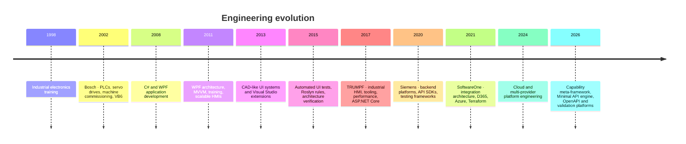

# Engineering journey

## 1998–2007 · Industrial systems

My engineering foundation was formed close to machines: industrial electronics, PLC programming, servo drives, process control, user interfaces, commissioning, troubleshooting, and customer training.

This environment taught me that software quality is operational reality. A defect is not an abstract ticket; it can stop an entire machine.

## 2008–2014 · C#, WPF, and UI architecture

I moved deeply into C#, WPF, MVVM, custom controls, scalable UI architectures, asynchronous execution, and developer tooling. I built CAD-like interaction systems and Visual Studio extensions to automate localization and repetitive development work.

## 2015–2020 · Architecture automation

At STOLL and TRUMPF, my work increasingly focused on:

- scalable and testable code;
- automated view tests;
- Roslyn-based architectural checks;
- solution and project configuration tests;
- performance and memory analysis;
- reusable object creation and test infrastructure;
- Visual Studio extensions and .NET global tools.

## 2020–today · Backend platforms and framework engineering

The focus shifted toward ASP.NET Core, APIs, cloud infrastructure, reusable SDKs, test platforms, OpenAPI, validation, deployment abstractions, and metadata-driven architecture.

The progression is consistent: from building individual systems to building foundations used by many systems.
