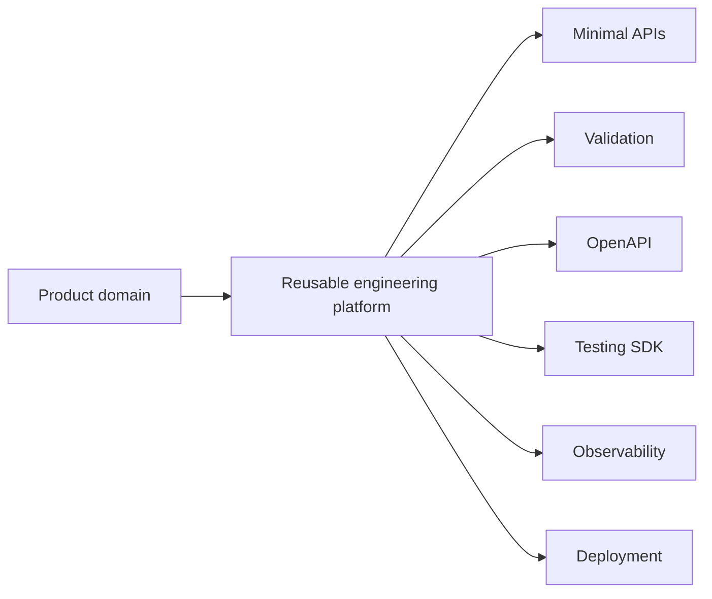

# Rene Peuser

<div class="grid cards" markdown>

-   :material-account-hard-hat:{ .lg .middle } **Principal Software Architect**

    ---

    More than two decades of software engineering, from industrial automation and HMIs to enterprise cloud platforms and framework engineering.

-   :material-hammer-wrench:{ .lg .middle } **Framework & SDK Engineer**

    ---

    Reusable .NET foundations, Minimal API platforms, validation engines, OpenAPI tooling, test SDKs, and developer automation.

-   :material-package-variant:{ .lg .middle } **Open-Source Maintainer**

    ---

    Nine packages and more than 4.1 million cumulative downloads on the public NuGet profile as of July 2026.

-   :material-presentation:{ .lg .middle } **Conference Speaker**

    ---

    Speaker at BASTA! and an experienced trainer for architecture, testing, WPF, MVVM, clean code, and modern .NET.

</div>

```text
> whoami

Name............... Rene Peuser
Role............... Principal Software Architect
Speciality......... Framework and platform engineering
Mission............ Make product teams faster through reusable foundations
Current focus...... Enterprise AI platform infrastructure
Primary stack...... C# · .NET · ASP.NET Core · Minimal APIs
Passion............. Testing · OpenAPI · Developer Experience · Automation
```

## I build engineering multipliers

A well-designed framework does more than remove duplicate code. It creates consistent APIs, centralizes cross-cutting concerns, raises the quality floor, and turns architectural knowledge into executable software.



## Featured work

### Capability meta-framework

A metadata-driven engine for representing and exposing heterogeneous cloud capabilities through consistent contracts, validation, OpenAPI schemas, lifecycle behavior, and provider abstractions.

[Read the case study →](projects/capability-meta-framework.md)

### Enterprise Minimal API platform

A reusable platform for designing, validating, documenting, testing, and operating a large API surface without repeating infrastructure concerns in every endpoint.

[Read the case study →](projects/minimal-api-platform.md)

### AspNetCore.Simple.MsTest.Sdk

A public test SDK built to make request/response integration tests, snapshots, schema assertions, content checks, and API regression tests concise and maintainable.

[Read the case study →](projects/testing-sdk.md)

## Engineering philosophy

> **Build once. Reuse everywhere. Automate everything.**

I believe infrastructure concerns such as versioning, error handling, validation, OpenAPI, testing, authentication, and observability should be solved deliberately, packaged cleanly, and reused consistently. Product teams should spend their energy on the domain—not on rebuilding plumbing.

[Explore the philosophy →](about/engineering-philosophy.md)
