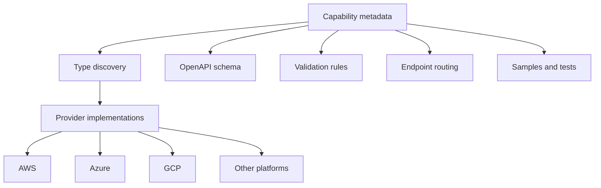

# Capability meta-framework

## Context

A multi-cloud platform can contain many heterogeneous capability types: storage, compute, databases, AI services, networking, integrations, and provider-specific resources.

Implementing every type as an isolated vertical slice leads to duplicated infrastructure and inconsistent behavior.

## Architectural idea

Represent stable capability characteristics through metadata and conventions, while retaining typed contracts for domain-specific behavior.

## Responsibilities

The framework coordinates:

- capability type discovery;
- typed create and update contracts;
- provider and capability mappings;
- generic endpoint behavior;
- validation metadata;
- OpenAPI schemas and discriminators;
- relationship modeling;
- deployment metadata;
- generated samples and integration tests.

## Design goals

- Add new capability types with minimal infrastructural duplication.
- Keep contracts strongly typed and discoverable.
- Preserve provider-specific semantics without leaking them everywhere.
- Generate consistent OpenAPI and client-facing models.
- Make validation rules reusable and centrally testable.
- Support hundreds of endpoints without hundreds of bespoke implementations.

## Key challenge

A meta-framework must avoid becoming a “magic” system. The architecture therefore favors explicit metadata, predictable conventions, diagnostics, and escape hatches over hidden runtime behavior.

## Outcome

The result is an engineering multiplier: new capabilities reuse platform behavior instead of reimplementing routing, validation, schemas, testing, and lifecycle mechanics.
