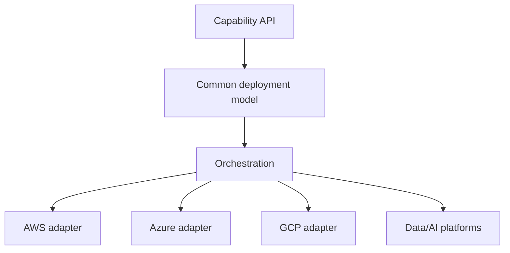

# Deployment and provider model

## Context

A capability platform spans heterogeneous providers and deployment lifecycles. AWS Lambda, GCP Vertex AI, Snowflake, Fabric, and other services do not expose identical resource models.

## Approach

Use a common lifecycle model for platform concerns while preserving provider-specific implementations.

## Areas addressed

- queued, in-progress, success, failure, and deletion states;
- idempotency and valid state transitions;
- deployment metadata;
- provider-specific orchestration;
- relation types between capabilities;
- cleanup behavior;
- stage-aware persistence;
- generic and provider-specific validation.

## Principle

Normalize what is genuinely common. Do not erase important provider semantics merely to force a uniform interface.
