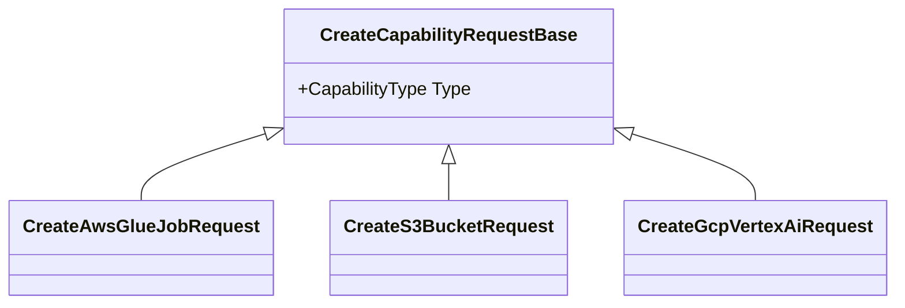

# OpenAPI infrastructure

## Scope

OpenAPI is treated as a first-class contract rather than an afterthought.

## Selected work

- Typed create-request hierarchies
- `oneOf` schema generation
- Discriminator property and mapping
- Capability-enum-to-request-type mapping
- Document transformers
- Duplicate schema elimination
- Self-reference protection
- Provider-aware schema composition
- Request and response sample integration
- Generated-client compatibility
- OpenAPI v1 contract evolution

## Example model

## Principle

The schema should accurately express the runtime contract. When polymorphism exists in the API, it should be represented explicitly enough for client generators, documentation tools, validators, and human readers.
