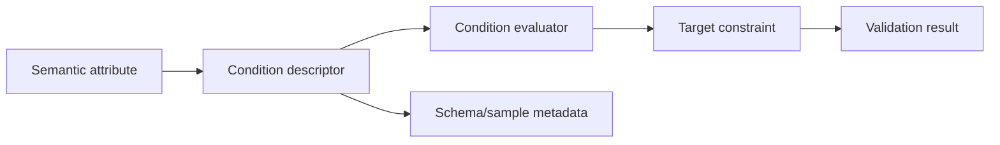

# Validation engine

## Motivation

Enterprise validation extends far beyond `[Required]`.

Real contracts contain:

- conditional requirements;
- cross-property comparisons;
- mutually exclusive values;
- property-dependent nullability;
- collection uniqueness and item constraints;
- domain-specific identifiers;
- provider-specific limits;
- relationship rules.

## Architecture



## Design direction

Semantic attributes express intent:

```csharp
[MustBeNullWhen(
    nameof(JobType),
    ConditionOperator.EqualsTo,
    AwsGlueJobType.PythonShell)]
public double? WorkerCount { get; init; }
```

A shared conditional-validation foundation handles:

- source-property lookup;
- comparison-value conversion;
- operator evaluation;
- target-property constraint evaluation;
- error-message construction;
- sample generation;
- OpenAPI integration.

## Representative rule families

- required / empty / null conditions;
- equality and property comparison;
- starts-with / ends-with;
- min/max item counts;
- duplicate detection;
- numeric ranges;
- identifier formats;
- conditional collection rules;
- provider and capability-specific constraints.

## Engineering concerns

- Attribute arguments must be compile-time constants.
- Delegates and expression trees cannot be supplied naturally as attribute constructor arguments.
- Reflection work should be cached.
- Error messages must identify source, target, operator, and expected behavior.
- Rule names should be semantically stable across repositories and languages.
